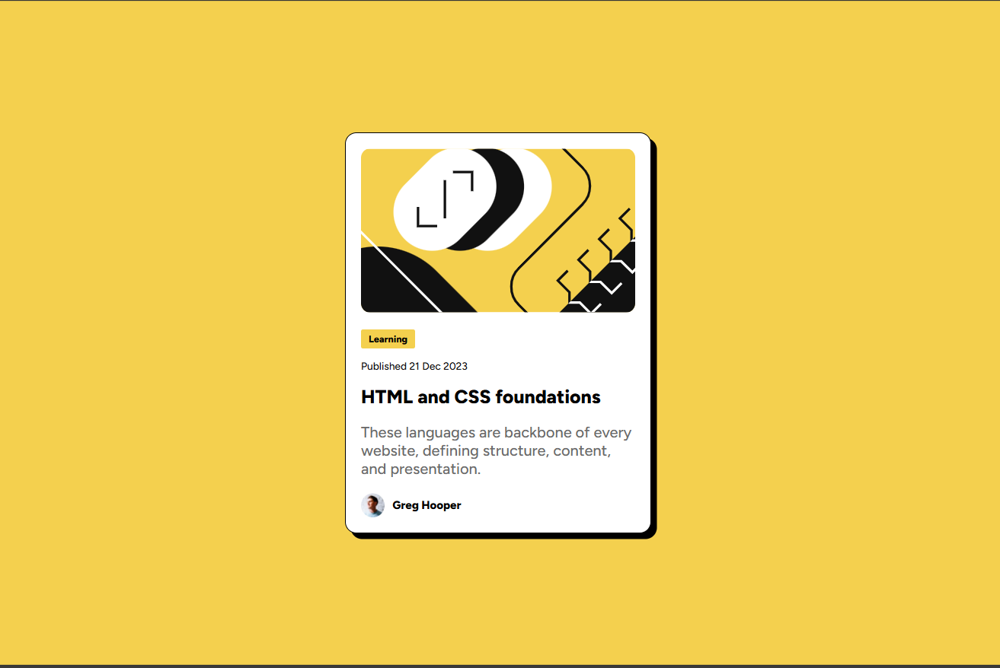

# Frontend Mentor - Blog preview card solution

This is a solution to the [Blog preview card challenge on Frontend Mentor](https://www.frontendmentor.io/challenges/blog-preview-card-ckPaj01IcS). Frontend Mentor challenges help you improve your coding skills by building realistic projects. 

## Table of contents

- [Overview](#overview)
  - [The challenge](#the-challenge)
  - [Screenshot](#screenshot)
  - [Links](#links)
- [My process](#my-process)
  - [Built with](#built-with)
  - [What I learned](#what-i-learned)
- [Author](#author)

## Overview

### The challenge

Users should be able to:

- See hover and focus states for all interactive elements on the page

### Screenshot



### Links

- Solution URL: [Solution URL](https://www.frontendmentor.io/solutions/blog-preview-card-using-flexbox-XJaM6OuFay)
- Live Site URL: [live site URL](https://kirankumari11.github.io/Blog-preview-card-main/)

## My process

### Built with

- Semantic HTML5 markup
- CSS custom properties
- Flexbox

### What I learned
I worked with local font files(ttf) using CSS @font-face. Below is the syntax:

```css
@font-face {
    font-family: "Figtree";
    src: url("./assets/fonts/static/Figtree-Medium.ttf");
    font-weight: 500;
    font-style: normal;
}
```

## Author
- Frontend Mentor - [@kirankumari11](https://www.frontendmentor.io/profile/kirankumari11)

